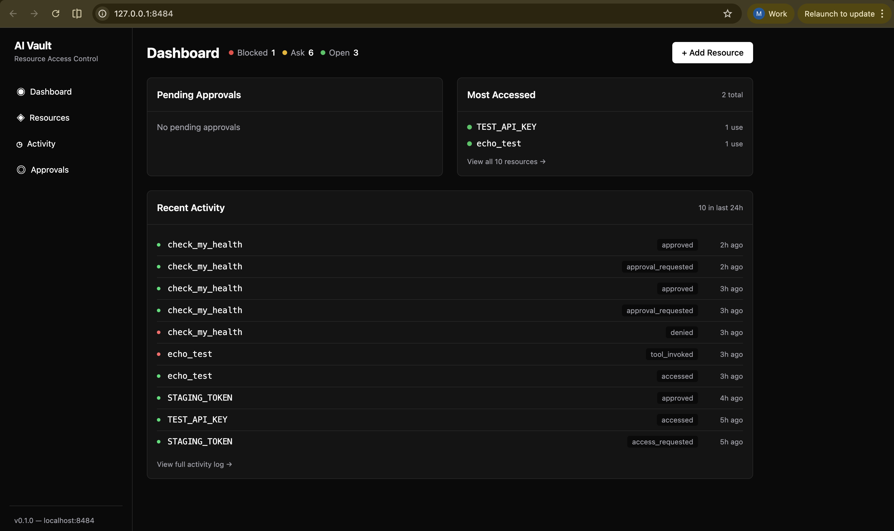

# AI Vault

**A firewall for your AI agent's tool access.**

AI Vault sits between Claude (or any MCP client) and your MCP tools, giving you visibility and control over what your AI agent can access. Every tool call is logged, and you decide what's allowed.

```
Claude Code  →  AI Vault  →  Your MCP Tools
                   ↓
              Dashboard at
           localhost:8484
```



## Why?

MCP tools are powerful — they let AI agents search the web, run code, access APIs, read files. But today there's no easy way to see what your agent accessed, or to block specific tools without removing them entirely.

AI Vault adds a control layer:

- **🔴 Blocked** — Tool is completely blocked. AI never sees it.
- **🟡 Ask** — Tool requires approval before each use.
- **🟢 Open** — Tool works freely. Every call is still logged.

## Quick Start

**Prerequisites:** Python 3.11+, Node.js 18+ (for UI build)

```bash
# Clone and install
git clone https://github.com/milosborenovic/ai-vault.git
cd ai-vault
python -m venv .venv && source .venv/bin/activate
pip install -e .

# Build the dashboard UI
cd ui && npm install && npm run build && cd ..

# One-command setup: imports your existing MCP tools + configures Claude
ai-vault setup

# Restart Claude Code to pick up the new config
```

That's it. Your existing MCP servers are now managed through the vault, and the dashboard is available at **http://localhost:8484** whenever Claude Code is running.

## What happens after setup?

1. **All your existing MCP tools** are imported into the vault (default: Ask level)
2. **Claude's config** (`~/.claude.json`) is updated to route through AI Vault
3. A **backup** of your original config is saved at `~/.claude.json.pre-vault-backup`
4. The **Web UI** starts automatically alongside the MCP server — no extra terminal needed

## Dashboard

The dashboard at `localhost:8484` shows:

- **Pending Approvals** — approve or deny tool access requests with one click
- **Most Accessed** — see which tools your AI uses most
- **Recent Activity** — full audit trail of every tool call, access attempt, and approval
- **Resource Management** — add, edit, or remove tools and secrets

## Adding New Tools

After setup, add new MCP tools through the vault instead of editing `~/.claude.json` directly:

**Via CLI:**
```bash
ai-vault add-tool github --command npx --arg "-y" --arg "@modelcontextprotocol/server-github"
ai-vault add-tool brave-search --command npx --arg "-y" --arg "@modelcontextprotocol/server-brave-search" --env "BRAVE_API_KEY=your-key"
```

**Via Dashboard:**
1. Open http://localhost:8484/resources
2. Click **+ Add Resource** → select **MCP Tool**
3. Fill in the command, arguments, and access level

## CLI Reference

```bash
ai-vault setup                    # One-command setup (init + import + configure)
ai-vault list                     # List all resources
ai-vault add NAME --value SECRET  # Add a secret
ai-vault add-tool NAME -c CMD     # Register an MCP tool
ai-vault delete NAME              # Delete a resource
ai-vault serve                    # Start the web UI standalone
ai-vault import-from-claude       # Import MCP servers from ~/.claude.json
```

## Architecture

AI Vault runs as a single process that serves two interfaces:

- **MCP stdio** — Claude Code talks to this (launched automatically)
- **HTTP on :8484** — Dashboard, REST API, and the approval UI

All data is stored locally in `~/.ai-vault/vault.db` (SQLite). Secrets are encrypted with AES-256-GCM. Nothing leaves your machine.

```
~/.ai-vault/
├── .env          # Encryption key (chmod 600)
└── vault.db      # SQLite database
```

## How It Works

When Claude calls a tool through the vault:

1. **Policy check** — Is the tool 🔴 blocked, 🟡 ask, or 🟢 open?
2. **If open** — Vault proxies the call to the downstream MCP server, logs it
3. **If ask** — Creates an approval request, waits for you to allow/deny in the dashboard
4. **If blocked** — Returns an error to Claude, logs the attempt

The vault manages MCP server lifecycle — it starts downstream servers on demand, proxies tool calls, and shuts them down when idle.

## Undoing Setup

```bash
# Restore your original Claude config
cp ~/.claude.json.pre-vault-backup ~/.claude.json
# Restart Claude Code
```

## Development

```bash
# Install dev dependencies
pip install -e ".[dev]"

# Run tests (126 passing)
pytest

# Run the UI in dev mode
cd ui && npm run dev
```

## License

MIT

---

<p align="center">
  Built by the team behind <a href="https://lucid.observer">Lucid Observer</a> — AI agent observability for teams.
</p>
